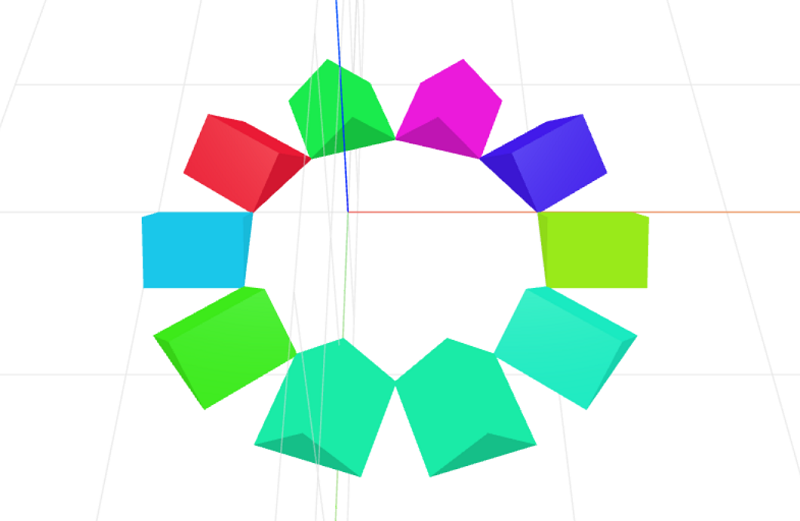

# sun-layout
Parameterized sun layout for CraftML

### Install
	$ npm install sun-layout

### Parameters
- radius: adjusts radius of item arrangement

### Example
```html
<craft name="flower">
    <craft name="petal" module="4yS59"/>
    <craft name="sun-layout" module="sun-layout"/>
    
    <sun-layout radius="7" color="crimson">
        <repeat n="5">
            <petal transform="scale(0.5,0.5,1)"></petal>
        </repeat>
    </sun-layout>

</craft>
```



